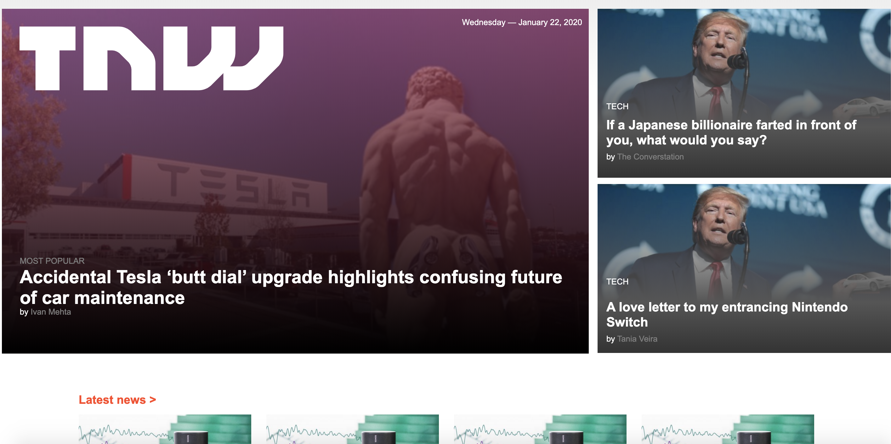

# The Next Web

This is project is meant to help the candidadate get a deeper understanding of responsive design and the different ways this can be achieved. It is better done in teams

## Built With

- HTML5
- CSS3

## Live Demo

[Live Demo Link](https://rawcdn.githack.com/paulo-techie/The-Next-Web/6e1cb89cb683f9c14c1f6919d1e73912264e05d8/index.html)

To get a local copy up and running follow these simple example steps:

### . Prerequisites
  - Have any browser that upports HTML5 and CSS#
### . Install
  - With the browser set, you do not need to install any other thing
  - Clone the files to your local
### . Usage
  - Open the index.html file
## Authors
  - 
👤 Jude Kajura

- Github: [@kbjude](https://github.com/kbjude)

👤 Paul Omondi

- Github: [@paulo-techie](https://github.com/paulo-techie)
- Linkedin: [paul-o-43051a31](https://www.linkedin.com/in/paul-o-43051a31)

## 🤝 Contributing

Contributions, issues and feature requests are welcome!

Feel free to check the [issues page](https://github.com/paulo-techie/The-Next-Web/issues).

## Show your support

Give a ⭐️ if you like this project!

## 📝 License

This project is [MIT](lic.url) licensed.
